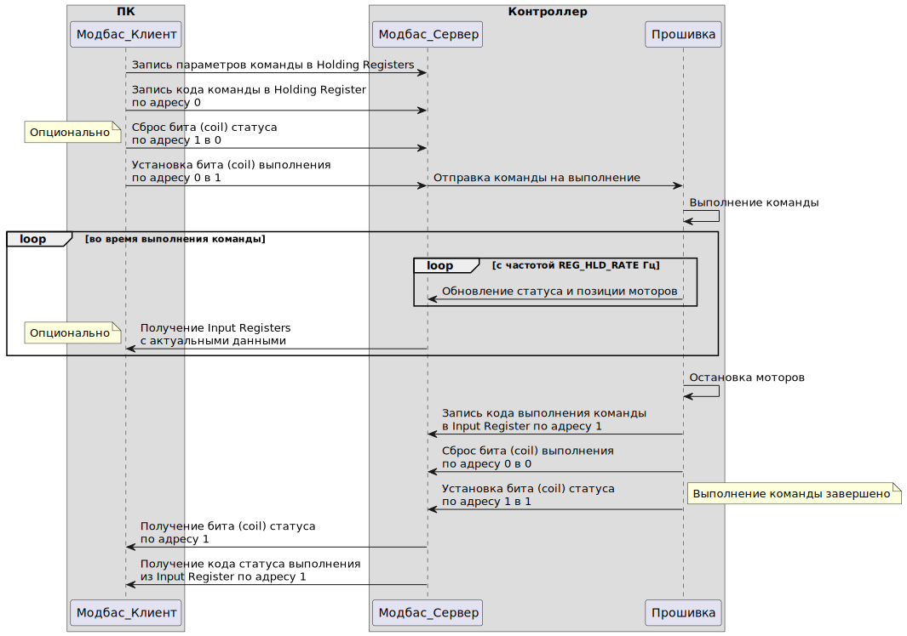

# Прошивка контроллера перемещения

## Принцип работы:

Контроллер перемещения получает команды от одноплатного компьютера по USB в режиме серийного порта по протоколу ModbusRTU.
Колеса приводятся в движение шаговыми двигателями через понижающий редуктор.
Количество шагов на оборот двигателя задается дип-переключателями на корпусе  драйвера и отражается в прошивке.
Коэффициенты редукторов и диаметры колес хранятся в постоянной памяти контроллера EEPROM и могут изменяться для точной настройки.

Получив команду на перемещение, контроллер переводит расстояние в миллиметрах в угол поворота колеса, затем в угол вала двигателя и количество необходимых шагов. Движение осуществляется в пределах заданных ускорения (торможения) и максимальной скорости.

Во время выполнения команды перемещения контроллер игнорирует все остальные команды, кроме команд остановки и торможения.

## Аппаратная совместимость

Прошивка совместима со контроллерами серии Arduino, имеющими напряжение на DO выходах от 5 В до 24 В. Необходимо не менее 6 свободных DO выходов.

Тестировалось на Arduino Mega 2560 rev 1.

## Используемые библиотеки

Все используемые библиотеки устанавливаются через  в Arduino IDE.

- [ArduinoModbus](https://github.com/arduino-libraries/ArduinoModbus): Реализация протокола ModbusRTU для Arduino.
- [ArduinoRS485](https://github.com/arduino-libraries/ArduinoRS485): Зависимость для ArduinoModbus.
- [EEManager](https://github.com/GyverLibs/EEManager): Библиотека для работы с постоянной памятью контроллера EEPROM.
- [GyverStepper2](https://github.com/GyverLibs/GyverStepper): Библиотека управления шаговыми моторами.

## Конфигурация перед прошивкой

В файле `src\firmware.ino` в первых строках необходимо установить следующие значения:

- `STEPS_REV` - количество шагов на оборот вала, одинаковое для обоих моторов, в соответствии с дип-переключателями на корпусе драйвера;
- `MOTOR_1_STEP_PIN` - номер пина для подключения сигнала STEP/PULSE - шаг 1го шагового драйвера;
- `MOTOR_1_DIR_PIN` - номер пина для подключения сигнала DIRECTION - направление вращения 1го шагового драйвера;
- `MOTOR_1_EN_PIN` - номер пина для подключения сигнала ENABLE - включение мотора 1го шагового драйвера;
- аналогично `MOTOR_2_STEP_PIN`, `MOTOR_2_DIR_PIN`, `MOTOR_2_EN_PIN` для 2го драйвера.

## Сборка

#### 1. VSCode + PlatformIO
Предпочтительный вариант, в редакторе [VSCode](https://code.visualstudio.com/) с установленным расширением [PlatformIO](https://docs.platformio.org/en/latest/integration/ide/pioide.html):
- открыть вкладку **PIO Home** (значок муравья слева);
- нажать кнопку **Open project**;
- в открывшемся окне выбрать данную папку **firmware**;
- внизу окна нажать значок галочки для компиляции, затем стрелки для загрузки прошивки в контроллер.

Тестировалось в Windows 10 и Linux (Ubuntu 22.04).

#### 2. Arduino IDE
В редакторе [Arduino IDE](https://www.arduino.cc/en/software/):
- в **Tools** -> **Library Manager** установить библиотеки из списка Используемых библиотек;
- открыть файл **src\src.ino**;
- нажать кнопку Verify / Upload.

Тестировалось в Windows 10.

## Описание используемого протокола

В рамках протокола `ModbusRTU` использованы следующие типы данных и значения:
- Coil - дискретный бит, чтение/запись;
- Input register - регистр (16 бит), только чтение;
- Holding register - регистр (16 бит), чтение/запись;
- Discrete input - не используется.

### Coil

| Имя            | Адрес  | Описание                     |
| -------------- | ------ | ---------------------------- |
| `COIL_NEW_CMD` |  `00`  | Признак отправленной команды |
| `COIL_NEW_STS` |  `01`  | Признак обновленного статуса выполнения команды |

### Input register

| Имя              | Адрес  | Описание                 |
| ---------------- | ------ | ------------------------ |
| `REG_INP_VER`    |  `00`  | Текущая версия протокола |
| `REG_INP_STS`    |  `01`  | Статус выполнения команды |
| `REG_INP_STPR_1` |  `02`  | Статус 1го мотора |
| `REG_INP_POS_1`  |  `03`  | Текущая позиция 1го мотора, в мм |
| `REG_INP_STPR_2` |  `04`  | Статус 2го мотора |
| `REG_INP_POS_2`  |  `05`  | Текущая позиция 2го мотора, в мм |

Статус выполнения команды `REG_INP_STS` может принимать следующие значения:
| Имя               | Код  | Описание                 |
| ----------------- | ---- | ------------------------ |
| `STS_OK`          | `0`  | Команда выполнена |
| `STS_ERR_MOVING`  | `1`  | Команда не может быть выполнена во время движения |
| `STS_ERR_CMD`     | `2`  | Неизвестная команда |
| `STS_ERR_PARAMS`  | `3`  | Ошибка в параметрах (для команды `CMD_UPDATE` ) |
| `STS_ERR_MODE`    | `4`  | Ошибочный режим работы (для команды `CMD_MODE` ) |
| `STS_ERR_DIR`     | `5`  | Ошибочное направление движения в ручном режиме (значение регистра `REG_HLD_MAN_DIR` ) |
| `STS_ERR_UNKNOWN` | `99` | Неизвестная ошибка |

Статус мотора `REG_INP_STPR` принимает следующие значения:
- 0 - стоим;
- 1 - едем;
- 4 - тормозим.

### Holding register

| Код               | Адрес  | Описание               |
| ----------------- | ------ | ---------------------- |
| `REG_HLD_CMD`     |  `00`  | Команда для исполнения |
| `REG_HLD_TARG_1`  |  `01`  | Абсолютная целевая позиция для 1го мотора, в мм |
| `REG_HLD_TARG_2`  |  `02`  | Абсолютная целевая позиция для 2го мотора, в мм |
| `REG_HLD_RATE`    |  `03`  | Частота обновления статусов и позиций моторов, в Гц |
| `REG_HLD_SPD_1`   |  `04`  | Максимальная скорость 1го мотора, в мм/сек |
| `REG_HLD_ACC_1`   |  `05`  | Максимальное ускорение 1го мотора, в мм/сек2 |
| `REG_HLD_GEAR_1`  |  `06`  | Коэффициент 1го редуктора |
| `REG_HLD_WHL_1`   |  `07`  | Диаметр 1го колеса, в мм |
| `REG_HLD_DIR_1`   |  `08`  | Направление вращения 1го мотора (0 или 1) |
| `REG_HLD_SPD_2`   |  `09`  | Максимальная скорость 2го мотора, в мм/сек |
| `REG_HLD_ACC_2`   |  `10`  | Максимальное ускорение 2го мотора, в мм/сек2 |
| `REG_HLD_GEAR_2`  |  `11`  | Коэффициент 2го редуктора |
| `REG_HLD_WHL_2`   |  `12`  | Диаметр 2го колеса, в мм |
| `REG_HLD_DIR_2`   |  `13`  | Направление вращения 2го мотора (0 или 1) |
| `REG_HLD_MODE`    |  `14`  | Режим работы (целевой или ручной) |
| `REG_HLD_MAN_DIR` |  `15`  | Направление движения в ручном режиме |

Команда для исполнения в `REG_HLD_CMD` может быть следующей:
| Имя          | Код  | Допустима     | Описание                 |
| ------------ | ---- | ------------- | ------------------------ |
| `CMD_BRAKE`  | `0`  | Всегда        | Экстренное торможение |
| `CMD_STOP`   | `1`  | Всегда        | Плавная остановка |
| `CMD_MOVE`   | `2`  | При остановке | Движение в заданную позицию |
| `CMD_UPDATE` | `3`  | При остановке | Записать регистры с адресами 04-13 в EEPROM |
| `CMD_MODE`   | `4`  | Всегда        | Переключение режима работы (предварительно вызывает `CMD_BRAKE`). |

Режим работы `REG_HLD_MODE` принимает следующие значения:
- 0 - авто, движение к цели (режим по умолчанию);
- 1 - ручной режим управления по пульту.

Направление движения в ручном режиме в `REG_HLD_MAN_DIR` может быть следующим:
- 0 - стоп (по умолчанию, при включении ручного режима);
- 1 - прямолинейное движение в перед;
- 2 - поворот на месте на право (по часовой стрелке);
- 3 - прямолинейное движение назад;
- 4 - поворот на месте на лево (против часовой стрелки).

## Диаграмма взаимодействия
